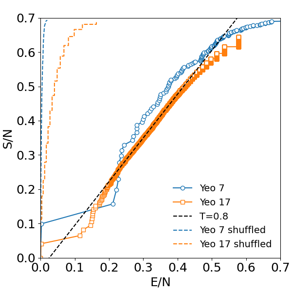
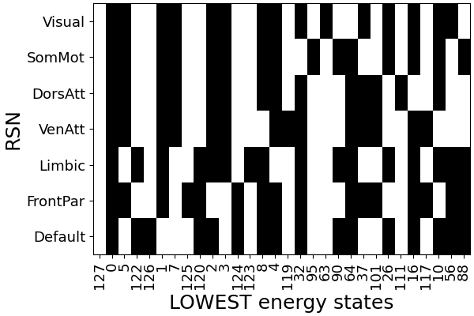

# Supplementary code 

Code and preprocessed data for reproducing Fig. 1B and 1C from the paper 

D.R. Chialvo, R.A. Janik, *Statistical thermodynamics of the human brain activity, the Hagedorn temperature and the Zipf law*


## Prerequisites

This code requires Python together with `numpy` and `matplotlib`. 
Easiest to first install Miniconda (https://docs.anaconda.com/free/miniconda/) and then write
```
conda install numpy matplotlib
```

## Reproducing figures

First we have to convert the binary state representations into integer identifiers. Also generate the decorrelated data by first randomly cyclically shifting each channel. To do that run
```
python prepare_stateids.py
```
Run
```
python plot_fig_1B.py
```
to reproduce Fig. 1B from the paper:



Run
```
python plot_fig_1C.py
```
to reproduce Fig. 1B from the paper:




## Information on downloading and preprocessing

The binarized data is obtained from 100 unrelated subjects from the Human Connectome Project Young Adult dataset  (https://www.humanconnectome.org/study/hcp-young-adult).
In the folder `preprocessing_info/` we provide sample scripts showing how the data was downloaded and what steps where used to preprocess them. Note that these scripts are **NOT** ready to run and require editing with HCP login credentials and/or modifying appropriate paths.

